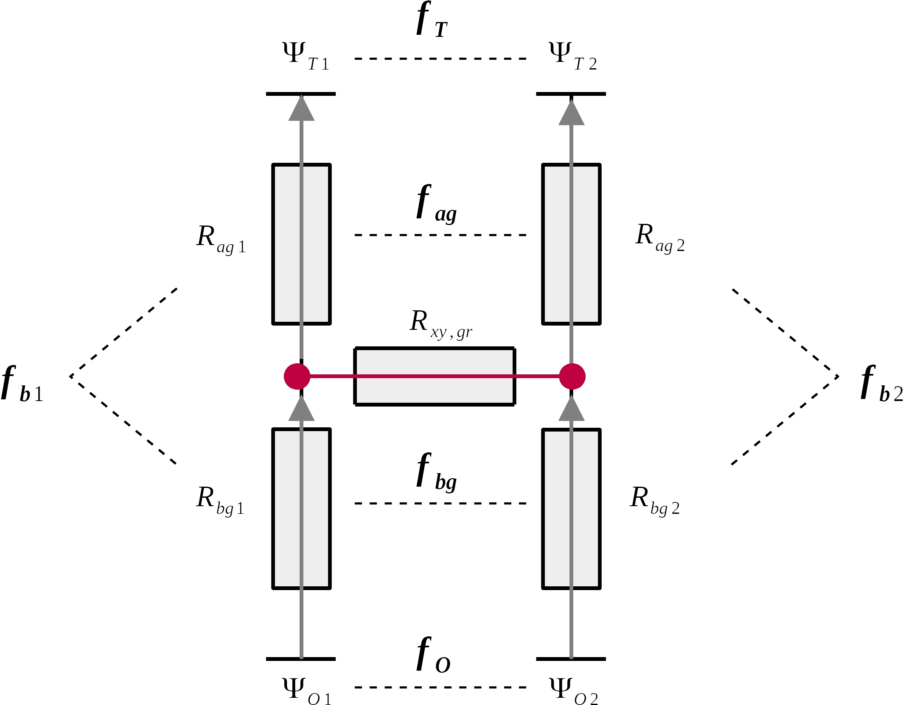

```{r setup, include=FALSE}
knitr::opts_chunk$set(echo = TRUE)
source("../../setup.R")
source("../../scripts/functions/functions_bettina_ext_static.R")
source("../../data/input/initialParameters.R")

library(sensitivity)
library(ggrepel)

fillcolors = c("#d8b365", "#260C7D", "#5ab4ac",
                "#7D410C", "#007D06",
                '#999999','#E69F00', '#56B4E9')
```

# Resistances against water flow

- Single, non-grafted tree: 4 resistances
   + Xylem resistances
      - Crown: $R_{xy,cr} = f(r_{stem}^2, k_{f,sap}, r_{crown})$
      - Stem: $R_{xy,st} = f(r_{stem}^2, k_{f,sap}, h_{stem})$
      - Root: $R_{xy,ro} = f(r_{stem}^2, k_{f,sap}, r_{root}$
   + Root surface permeability
      - $R_{ro} = f(r_{root}^2, L_{P}, RAI_{froot})$

Assumption in the main text

   + $R_{xy,cr} + R_{xy,st} + R_{xy,ro} = R_{ro}$  
   + $R_{ag} = R_{xy,cr} + R_{xy,st}$  
   + $R_{bg} = R_{xy,ro} + R_{ro}$  
   
   --> % $f_b = \frac{R_{bg}}{R} > 50 %$

   
Findings in Rodriguez-Dominguez & Brodribb (2020)

   --> % $f_b = \frac{R_{bg}}{R} > 80 %$


<br><br>

# Theoretical exploration

- Pair of grafted trees
- Ratios of resistances were varied and their influence on water exchange was assessed

{width=60%}


```{r get_exchange_pairFunction}
get_exchange_pair_wrap = function(x){
   Rgraft = x[1][[1]]
   rag_factor = x[2][[1]]
   rbg_factor = x[3][[1]]
   below1 = x[4][[1]]
   lh_factor = x[5][[1]]
   o_factor = x[6][[1]]
   r = get_exchange_pair(Rgraft, rag_factor, rbg_factor, below1, 
                             lh_factor, o_factor)
   return(r)
}

get_exchange_pair_wrap_morris = function(x){
   Rgraft = 1
   rag_factor = x[1][[1]]
   rbg_factor = x[2][[1]]
   below1 = x[3][[1]]
   lh_factor = x[4][[1]]
   o_factor = x[5][[1]]
   r = get_exchange_pair(Rgraft, rag_factor, rbg_factor, below1, 
                             lh_factor, o_factor)
   print(cbind(r$out1, r$in1, r$rg, r$out2, r$in2, r$f_b1, r$f_b2))
   return(cbind(r$out1, r$in1, r$rg, r$out2, r$in2, r$f_b1, r$f_b2))
}

get_exchange_pair = function(Rgraft, rag_factor, rbg_factor, below1, 
                             lh_factor, o_factor){
   rag1 = 1
   rag2 = rag1/ rag_factor
   
   rbg1 = below1 * rag1 / (1 - below1)
   rbg2 = rbg1 / rbg_factor
   
   r1 = rag1 + rbg1
   r2 = rag2 + rbg2
   
   lh1 = 1
   lh2 = lh1 / lh_factor
   
   o1 = 1
   o2 = o1 / o_factor
   
   row1 = c(-1, 1, 1, 0, 0)
   row2 = c(0, 0, -1, -1, 1)
   row3 = c(-rag1, 0, - Rgraft, rag2, 0)
   row4 = c(0, -rbg1,  Rgraft, 0, rbg2)
   row5 = c(-rag1, -rbg1, 0, 0, 0)
   A = matrix(c(row1, row2, row3, row4, row5),
              nrow = 5, byrow = T)
   
   lh1lh2 = lh1 - lh2
   o2o1 = o2 - o1
   deltapsi1 = lh1 - o1
   
   B = matrix(c(0, 0, lh1lh2, o2o1, deltapsi1), nrow = 5, byrow = T)
   r = solve(A, B)
   r = data.frame(out1 = r[1], in1 = r[2], rg = r[3],
                  out2 = r[4], in2 = r[5], 
                  f_b1 = rbg1/r1*100,
                  f_b2 = rbg2/r2*100)
   return(r)
}


```

<br>

**Ratios that result from reference hydr. parameters and observed tree geometries**

```{r loadResPairs}
load(file = "../../data/results/results_setup1_pairs.rda") # res.pairs
```


```{r loadT9}
load(file = "../../data/input/model_trees_loc9.rda") # t9
```


<br>

**Random sampling**

- N = 1000

```{r y, eval = F}
set.seed(5)
N = 1000
x = data.frame(Rgraft = rep(1, N),
               f_ag = runif(N, min = 0.1, max = 15),
               f_bg = runif(N, min = 0.1, max = 15),
               b1 = runif(N, min = 0.5, max = 0.95),
               f_L = runif(N, min = 0.95, max = 1.05),
               f_O = runif(N, min = 0.5, max = 1.5))

y = do.call(rbind,
        apply(x, 1, get_exchange_pair_wrap)
        )
y = cbind(x, y)

save(y, file = "../../data/results/S4_y_R_theory.rda")

```


```{r}
load(file = "../../data/results/S4_y_R_theory.rda") #y
```

```{r out.width="100%"}
k = y %>% 
   filter(f_b2 > 50) %>% 
   mutate(col = f_O) %>% 
   gather(., key, value,  f_ag, f_bg, f_L, f_O, f_b1, f_b2)
k %>%
   mutate(key = factor(key,
                levels = unique(k$key),
                ordered = TRUE, 
                labels = c(expression(paste(r['ag'])),
                           expression(paste(r['bg'])),
                           expression(paste(r['T'])),
                           expression(paste(r['O'])),
                           expression(paste(f['b1'])),
                           expression(paste(f['b2']))))) %>% #View()
   ggplot(., aes(x = value, y = rg, fill = col)) +
   geom_point(shape = 21, size = 3) +
   geom_hline(yintercept = 0) +
   scale_fill_gradient2(mid = "white", low = "darkblue",
                        high = "darkred", midpoint = 1,
                        limits = c(0.5, 1.5),
                        breaks = c(0.5, 1, 1.5)) +
   facet_wrap(~ key, scales = "free",
              labeller = label_parsed) +
   labs(y = "Theoretic flow from T1 to T2",
        fill = expression(paste(r['O'], "  ")))  +
   theme(text = element_text(size = 14))

# ggsave(filename = "FigS14.jpg", dpi = 450,
       # height = 7, width = 9)
```

_Figure S14 Scatter plot of water potential and resistance ratios of trees T1 and T2 and the theoretical flow between them. Positive values of flow indicate flow from tree T1 to tree T2, i.e. a water loss for tree T1, and vice versa. Color indicates salinity ratio rO. If circles are blueish, the salinity below tree T1 is lower than below tree T2, that is, tree T1 has a better water accessibility._

<br>


**Morris screening**

Morris function attributes:

- repititions: 4
- levels: 6

```{r}
rep = 4
lev = 6
```


```{r morrisTheory, eval=F}
run.morris.theo = function(rep, lev, seed){
   x_oat = morris(model = get_exchange_pair_wrap_morris,
                  factors = c("f_ag", "f_bg", "f_b1", "f_L", "f_O"),
                  r = 20,
                  design = list(type = "oat", levels = 6, grid.jump = 3),
                  scale = T,
                  loop = T,
                  binf = c(0.1, 0.1, 0.5, 0.95, 0.5),
                  bsup = c(15, 15, 0.95, 1.05, 1.5))
   
   # store and extract results
   y = data.frame(x_oat[["y"]]) %>%
      setNames(c("AVAIL1", "ABS1", "AWG", "AVAIL2", "ABS2", "f_b1", "f_b2"))
   sim.theo = data.frame(x_oat[["X"]],
                                y) 
   
   mu <- apply(x_oat$ee, 4, function(M){
      apply(M, 2, function(x) mean(x, na.rm = T))
   })
   
   mu.star <- apply(abs(x_oat$ee), 4, function(M){
      apply(M, 2, function(x) mean(x, na.rm = T))
   })
   sigma <- apply(x_oat$ee, 4, function(M){
      apply(M, 2, function(x) sd(x, na.rm = T))
   })
   
   morris.theo = bind_rows(
                     data.frame(mu) %>% mutate(morris = "mu",
                                                  var = colnames(x_oat[["X"]])),
                     data.frame(mu.star) %>% mutate(morris = "mu.star",
                                                    var = colnames(x_oat[["X"]])),
                     data.frame(sigma) %>% mutate(morris = "sigma",
                                                  var = colnames(x_oat[["X"]]))) %>% 
      setNames(., c("AVAIL1", "ABS1", "AWG", "AVAIL2", "ABS2", "f_b1", "f_b2",
                    "morris", "param"))
   morris.theo = morris.theo %>%
      gather(., output.var, output, AVAIL1:f_b2) %>%
      filter(output.var != "f_b1") %>% 
      spread(., key = morris, value = output) 

   return(list(sim.theo, morris.theo))

}

set.seed(1)
seeds = sample.int(10000, 10)
print(seeds)
sim.theo = data.frame()
morris.theo = data.frame()
for (s in seeds){
   print(s)
   r = run.morris.theo(rep, lev, s)
   sim.theo = rbind(sim.theo,
                    r[[1]] %>% mutate(seed = s))
   morris.theo = rbind(morris.theo,
                       r[[2]] %>% mutate(seed = s))
}

save(sim.theo, 
     file = paste("../../data/results/morris_xy_theo_S4_r", rep, "_l", lev, "_10reps.rda", 
                  sep = ""))
save(morris.theo, 
     file = paste("../../data/results/morris_ee_theo_S4_r", rep, "_l", lev, "_10reps.rda", 
                  sep = ""))
```

```{r loadMorris}
load(file = "../../data/results/morris_xy_theo_S4_r4_l6_10reps.rda")
load(file = "../../data/results/morris_ee_theo_S4_r4_l6_10reps.rda")
```


```{r out.width="100%"}
sds = sim.theo %>% 
   group_by(seed) %>% 
   distinct(ABS1 = sd(ABS1), AVAIL1 = sd(AVAIL1), AWG = sd(AWG)) %>% 
   gather(., output.var, sd, ABS1, AVAIL1, AWG)

morris.theo.new = merge(morris.theo, sds, by = c("seed", "output.var"))


morris.theo.new = morris.theo.new %>%
   filter(output.var != "f_b2") %>%
   filter(output.var != "ABS2") %>% 
   filter(output.var != "AVAIL2") %>% 
   mutate(output.var_name = factor(output.var,
                                   levels = c("ABS1", "AVAIL1", "AWG"),
                              labels = c(expression(paste(ABS['T1'])),
                                         expression(paste(AVAIL['T1'])),
                                         expression(paste(AWG)))))


morris.theo.new %>% 
   mutate(sigma = sigma/sd,
          mu.star = mu.star/sd) %>%
   mutate(param = factor(param,
                levels = unique(morris.theo$param),
                ordered = TRUE, 
                labels = c(expression(paste(r['ag'])),
                           expression(paste(f['b1'])),
                           expression(paste(r['bg'])),
                           expression(paste(r['T'])),
                           expression(paste(r['O']))))) %>% 
   group_by(param, output.var_name) %>% 
   distinct(x.m = mean(mu.star), x.sd = sd(mu.star),
            y.m = mean(sigma), y.sd = sd(sigma)) %>% 
   filter(y.m != 0) %>% 
   ggplot(., aes(x = x.m, y = y.m, col = param)) +
   geom_point(size = 3) +
   geom_linerange(aes(ymin = y.m-y.sd, ymax = y.m+y.sd)) +
   geom_linerange(aes(xmin = x.m-x.sd, xmax = x.m+x.sd)) +
   geom_text_repel(aes(label = param, col = param), size = 4, parse = T) +
   scale_color_hue() +
   facet_wrap(~ output.var_name, ncol = 3, scales = "free",
              labeller = label_parsed) +
   labs(x = expression(mu~'*'),
        y = expression(sigma),
        col = "Input parameter") +
   guides(col = F) 

# ggsave(filename = "fig_S13.jpg", dpi = 450,
#        height = 3, width = 7)
```

_Figure S13 Results of the Morris screening for the theoretical exploration of flow resistances, explaining the influence of input parameters on theoretical flow patterns, i.e. the amount of water absorbed from the soil by tree T1 (ABST1), the amount of water available to T1 (AVAILT1) and the amount of water exchanged (AWG). µ* indicates the linear influence of input factors, while σ indicates non-linear and interactive influence. µ* and σ are normalized by diving results by the standard deviations of ABST1, AVAILT1 and AWG._

